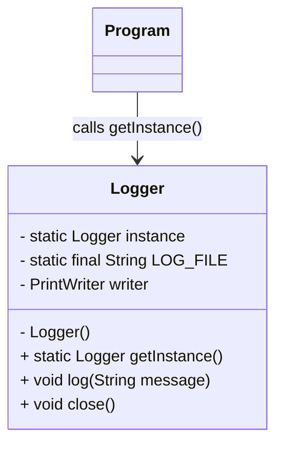
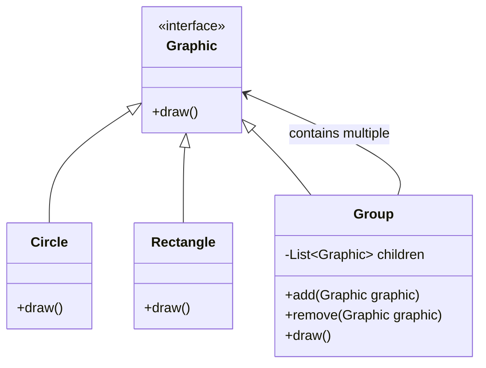

# SWE4403 - Assignment 2

**Author:** Shahriar Kariman

## Design Pattern Descriptions

### Design Pattern 1 - Singleton

The Singleton design pattern is a creational design pattern used when it is preferred to only have one instance of an object in the program
a good example for this could be a logger documenting activity into a file in such a case if a new logger instance is created every time each
one would start from the beginning of the file and override the content of the previous activities so you would need to have one logger open to know
where to continue logging in the file.

### Design Pattern 2 - Composite

The composite design pattern is meant to allow multiple object that can be manipulated in the same way it is often used alongside
a tree structure that way nodes of the tree can be treated the same for certain functionalities.

This design pattern is used frequently in game engines specifically for managing nodes/groups containing objects or other groups
and this is advantageous for rendering because changes to a groups position would automatically be applied to its children regardless of
whether or not the child is a scene or a concrete mesh.

Another reason why game engines use this pattern with the help of trees is to make traversing a 3D space faster allowing to render objects closer
to a view with more detail preserving computational power I could explain how that works more but I feel that it is not the point of this assignment.

## Design Pattern Sample Implementation

### Sample Implementation 1 - Singleton Logger

Although technically we have already made this in the lab once here is the logger:

```java
import java.io.FileWriter;
import java.io.IOException;
import java.io.PrintWriter;

public class Logger {
  private static Logger instance;
  private static final String LOG_FILE = "log.txt";
  private PrintWriter writer;

  private Logger() {
    try {
      writer = new PrintWriter(new FileWriter(LOG_FILE, true));
    } catch (IOException e) {
      e.printStackTrace();
    }
  }

  public static Logger getInstance() {
    if (instance == null) {
      synchronized (Logger.class) {
        if (instance == null) {
          instance = new Logger();
        }
      }
    }
    return instance;
  }

  public void log(String message) {
    writer.println("[LOG] " + message);
    writer.flush();
  }

  public void close() {
    if (writer != null) {
      writer.close();
    }
  }
}
```

I mean I think the code is pretty self explanatory the constructor is private and the `getInstance()` function is static so any object in the project
can call to get the instance of the logger and the logger itself is created the first time `getInstance()` is called.

### Sample Implementation 2 - Composite 2D Game Engine

```java
interface Graphic {
  void draw();
}

class Circle implements Graphic {
  public void draw() {
    System.out.println("Drawing a Circle");
  }
}

class Rectangle implements Graphic {
  public void draw() {
    System.out.println("Drawing a Rectangle");
  }
}

class Group implements Graphic {
  private ArrayList<Graphic> children = new ArrayList<>();

  public void add(Graphic graphic) {
    children.add(graphic);
  }

  public void remove(Graphic graphic) {
    children.remove(graphic);
  }
  
  public void draw() {
    for (Graphic graphic : children) {
      graphic.draw();
    }
  }
}
```

I think it is important to note that a Group can have other Groups as its children and Circles and Rectangles but they can be treated uniformly when drawing.

## Design Pattern UML Diagrams

### UML Diagram 1 - Singleton Logger



### UML Diagram - Design Pattern 2



## Pattern Comparisons - Singleton vs Composite

I think this part of the assignment about comparing isn't really required after all how would I compare a creational design pattern with a structural design pattern they are
meant to do different things its like comparing apples and oranges.

As I have mentioned composite is appropriate to use when you want to treat multiple objects as if they where the same objects and singleton is appropriate to use when you only
want one instance of an object for the entire system. But there is nothing stopping anyone to use both of these patterns in the same project for example if you had a game
you could use the composite pattern for characters and objects in a scene and have the global game state initialized and accessed with the singleton pattern.
